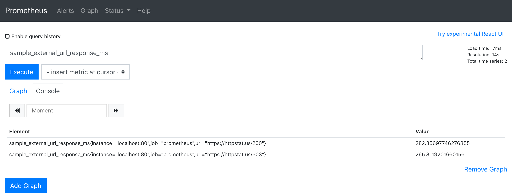
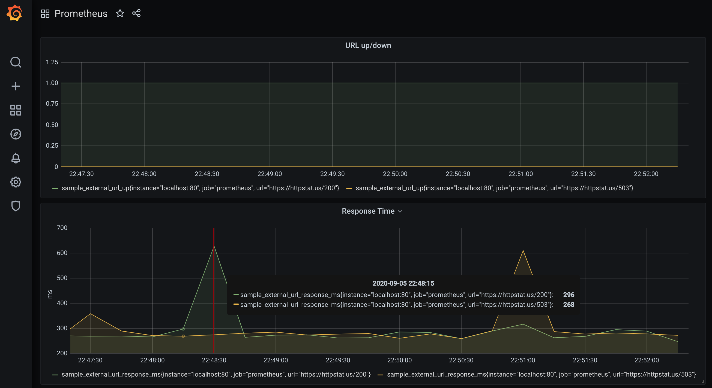

# Prometheus Metric Monitoring Example
This is a uptime check monitoring service designed to be deployed on Kubernetes Cluster.

[](https://coveralls.io/github/qiuosier/prometheus?branch=master)

This service can be accessed via any endpoint address with HTTP GET request, including `/metrics`, e.g. https://example.com/metrics.

When the endpoint is accessed, this service checks the following two external URLs and return 4 metrics in [Prometheus format](https://prometheus.io/docs/instrumenting/exposition_formats/#text-format-example).
* https://httpstat.us/503
* https://httpstat.us/200

There are two metrics for each URL:
* Whether the URL is up and running
* The response time in milliseconds

A response with 200 status code is considered as up and running, while any other response status code, including 503, are used to indicate the service is down (or attention is needed).

Below is an example of the response:
```
# HELP sample_external_url_up URL Up
# TYPE sample_external_url_up gauge
sample_external_url_up{url="https://httpstat.us/503"} 0.0
sample_external_url_up{url="https://httpstat.us/200"} 1.0
# HELP sample_external_url_response_ms Response Time
# TYPE sample_external_url_response_ms gauge
sample_external_url_response_ms{url="https://httpstat.us/503"} 298.56300354003906
sample_external_url_response_ms{url="https://httpstat.us/200"} 306.61916732788086
```

See also: [Prometheus](https://prometheus.io/)

## Requirements
This service is developed in Python 3.7. 

The following packages are required:
* requests
* prometheus_client

The exact version of each package is specified in the `requirements.txt` file. To install the package, run:
```
pip install -r requirements.txt
```

## Running the Service
This service can be started by the following command:
```
python app.py
```
By default, there will be a 1 second delay between two subsequent uptime check.

Optionally, you can specify the time interval between two checks by passing a number with the command:
```
python app.py 5
```
The above command will perform the uptime check 5 seconds after the previous check. Note that this is the time interval between two subsequent checks. This does not mean the checks are performed every 5 seconds since the uptime check itself may take about 1 second, depending on the network connection and external service.

The metrics will always return the most recent uptime check results. 

This uptime time service will timeout if the URL fail to return any data in 5 seconds. Without timeout, the service may hang indefinitely if external URL does not response. Note that the timeout applies to data chunks instead of the whole connection. When timeout occurs, the URL is considered as down and the response time will be set to `inf`.

See also: [Request Timeout](https://requests.readthedocs.io/en/master/user/quickstart/#timeouts)

## Docker Image
This service is available as a docker image: [qiuosier/prometheus_metrics](https://hub.docker.com/r/qiuosier/prometheus_metrics)

Docker pull command:
```
docker pull qiuosier/prometheus_metrics
```
The docker image is based on `python:3.8-alpine`. Port 80 (HTTP) is exposed for the service.

To run the docker image on local computer, use the following command
```
docker run -dit -p 8080:80 qiuosier/prometheus_metrics
```
This command maps the service to port 8080 on `localhost`. Once the docker image is running, the metrics will be available at http://localhost:8080

The docker image has a default entry point of `python` and default command/argument of `app.py`, which will start the service and perform the uptime check every one second.

This repository uses Github action to automatically build and push the docker image to Docker Hub.

See also: [Docker Commands](https://docs.docker.com/engine/reference/commandline/docker/)

## Kubernetes Deployment Specifications
The `deployment.yaml` file contains specifications for deploying this service to a kubernetes cluster using the docker image (`qiuosier/prometheus_metrics`)

The following command will deploy the service on the kubernetes cluster authenticated with your account.
```
kubectl apply -f deployment.yaml
```
See also: [Kubernetes Deployments](https://kubernetes.io/docs/concepts/workloads/controllers/deployment/)

## Functions and Tests
This service is built on 3 functions in `app.py`:
* `check_url()`, Checks if a URL is up and track the response time by sending HTTP GET request.
* `uptime_check()`, Performs uptime checks to two URLs.
* `parse_arguments()`, Parses the command line arguments.

The return values of `check_url()` and `uptime_check()` are mainly designed for testing purpose.
The `tests.py` contains unit tests for these three functions. Tests can be executed with the following command:
```
python -m unittest discover -v -s . -p "test*.py"
```

This repository uses travis-ci to perform automated testing whenever a commit is pushed to the master branch. The test coverage is available at https://coveralls.io/github/qiuosier/prometheus

## Prometheus Server
The `prometheus.yml` file is an example config file for Prometheus server to monitor this service running locally on port 80.

The following figure shows a simple query on the Prometheus server:


The following figure visualizes the metrics in Grafana:


See also:
* [Getting Started with Prometheus Server](https://prometheus.io/docs/prometheus/latest/getting_started/#getting-started)
* [Grafana Support for Prometheus](https://prometheus.io/docs/visualization/grafana/)
